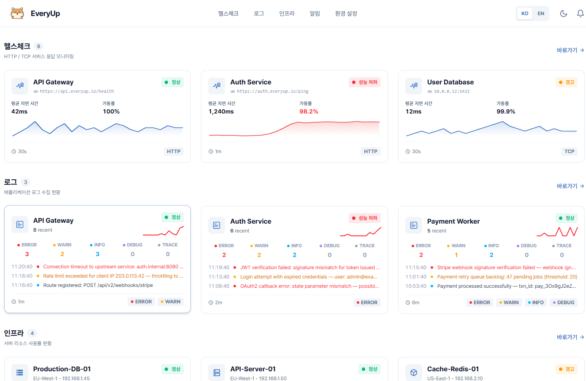

<p align="center">
  
</p>

<h1 align="center">EveryUp</h1>

<p align="center">
  헬스체크, 인프라, 로그, 알림을 한곳에 모은 가벼운 셀프 호스팅 모니터링 대시보드.
</p>

<p align="center">
  <a href="README.md">English</a> ·
  <a href="https://ai-turn.github.io/everyup/">라이브 데모</a> ·
  <a href="#빠른-시작">빠른 시작</a> ·
  <a href="#문서">문서</a>
</p>

<p align="center">
  <a href="https://ai-turn.github.io/everyup/"></a>
  
  
  
  
  
</p>

<p align="center">
  
</p>

EveryUp은 작은 팀과 셀프 호스팅 환경에서 서비스 상태와 응답 시간, 서버 리소스, 애플리케이션 로그, OpenTelemetry 트레이스, 알림 발송 현황을 한곳에서 확인할 수 있게 해줍니다. Go 바이너리와 SQLite로 동작하므로 Prometheus, Grafana, Elasticsearch 같은 별도 모니터링 스택 없이 배포할 수 있습니다.

## 왜 EveryUp인가요?

- **하나의 대시보드** - 헬스체크, 인프라, 로그, API 요청, 알림을 함께 봅니다.
- **내 인프라에 보관** - 모니터링 데이터가 내 인프라 밖으로 나가지 않습니다.
- **단순한 운영** - 별도 모니터링 스택 대신 컨테이너 하나와 데이터 볼륨 하나로 시작합니다.
- **OpenTelemetry 연동** - 기존 SDK, 컬렉터, 자동 계측에서 OTLP 로그와 트레이스를 보낼 수 있습니다.

## 주요 기능

| 영역 | 제공 기능 |
| --- | --- |
| **헬스체크** | HTTP/TCP 상태 확인, 가동률 통계, 응답 시간 추이, 장애 감지 |
| **인프라** | 로컬 또는 SSH 원격 호스트의 CPU, 메모리, 디스크, 네트워크, 프로세스 확인 |
| **로그와 트레이스** | OTLP/HTTP 수집, 로그 검색, 레벨 필터 |
| **API 요청** | OpenTelemetry 서버 스팬 기반 요청/응답 확인, 마스킹, 샘플링 제어 |
| **알림** | Telegram, Discord, Slack, Webhook 채널과 임계값 기반 규칙 |

## 빠른 시작

Docker Compose로 시작하는 방법을 권장합니다. 저장소를 받은 뒤 포함된 compose 파일로 실행하고, 브라우저에서 관리자 계정을 만듭니다. 처음 실행할 때 암호화 키와 JWT 서명 키가 자동으로 생성됩니다.

```bash
git clone https://github.com/ai-turn/everyup.git
cd everyup
docker compose up -d
```

`http://localhost:3001`로 접속합니다.

포트나 시간대를 바꾸거나 관리자 계정을 미리 만들려면 Compose 실행 전에 `.env.example`을 `.env`로 복사해 수정하세요. 배포 이미지는 `linux/amd64`와 `linux/arm64`를 지원합니다.

## Docker로 실행

저장소를 받지 않고 EveryUp을 실행하려면 배포 이미지를 먼저 내려받습니다.

```bash
docker pull aiturn/everyup:latest
docker run -d --name everyup -p 3001:3001 -v everyup-data:/app/data aiturn/everyup:latest
```

`http://localhost:3001`로 접속해 관리자 계정을 만듭니다.

## 설정

대부분의 설치는 별도 설정 파일 없이 시작할 수 있습니다. Docker Compose는 `.env` 파일을 자동으로 읽으므로, 설정을 바꿔야 할 때는 [`.env.example`](.env.example)을 참고해 `.env` 파일을 만드세요.

| 환경 변수 | 용도 |
| --- | --- |
| `EVERYUP_SERVER_PORT` | HTTP 포트 변경 |
| `EVERYUP_ADMIN_USERNAME` | 시작 시 관리자 계정 생성 또는 재설정 |
| `EVERYUP_ADMIN_PASSWORD` | 위 관리자 계정에 사용할 비밀번호 |
| `EVERYUP_DATABASE_PATH` | SQLite 데이터베이스 경로 변경 |
| `EVERYUP_ENCRYPTION_KEY` | 운영자가 관리할 64자리 16진수 암호화 키 지정 |
| `TZ` | 컨테이너 시간대 지정, 예: `Asia/Seoul` |

> `EVERYUP_ADMIN_USERNAME`과 `EVERYUP_ADMIN_PASSWORD`를 함께 설정하면 EveryUp은 시작할 때마다 해당 계정을 생성하거나 비밀번호를 재설정합니다. 의도한 경우가 아니라면 초기 설정 후에는 비워 두는 편이 좋습니다.

프론트엔드를 분리 배포한다면 `EVERYUP_SERVER_ALLOWORIGINS`도 필요할 수 있습니다. 자세한 백엔드 설정은 [`.env.example`](.env.example)과 [backend/README.md](backend/README.md)를 참고하세요.

## 로그와 트레이스 보내기

**로그 -> 서비스 상세 -> 연동**에서 API 키를 만든 뒤 OTLP/HTTP 전송 대상을 EveryUp으로 지정합니다.

```bash
export OTEL_SERVICE_NAME="{your-service-name}"
export OTEL_EXPORTER_OTLP_ENDPOINT="http://your-everyup-server:3001/api/v1/otlp"
export OTEL_EXPORTER_OTLP_HEADERS="Authorization=Bearer {your-everyup-api-key}"
export OTEL_EXPORTER_OTLP_PROTOCOL="http/protobuf"
export OTEL_LOGS_EXPORTER="otlp"
export OTEL_TRACES_EXPORTER="otlp"
```

EveryUp은 `/api/v1/otlp/v1/logs`와 `/api/v1/otlp/v1/traces`에서 OTLP/HTTP 로그와 트레이스를 받습니다.

<sub>메트릭(`OTEL_METRICS_EXPORTER`)은 아직 지원하지 않습니다 — 설정하지 않거나 `none`으로 두세요.</sub>

## 데이터 백업

업그레이드나 마이그레이션 전에는 데이터 디렉터리를 백업하세요. 기본 Docker 설정에서는 SQLite 데이터베이스와 자동 생성된 암호화 키 파일이 `/app/data`에 함께 저장됩니다. `EVERYUP_ENCRYPTION_KEY`를 설정한 배포라면 해당 키도 별도로 보관해야 합니다.

자세한 절차는 [백업과 복원](docs/BACKUP_RESTORE.ko.md)을 참고하세요.

## 로컬 개발

사전 준비: [Go 1.24+](https://go.dev/dl/), [Node.js 22+](https://nodejs.org/), [pnpm](https://pnpm.io/installation).

```bash
git clone https://github.com/ai-turn/everyup.git
cd everyup
```

한 터미널에서 백엔드 실행:

```bash
cd backend
go run ./cmd/server
```

저장소 루트에서 다른 터미널을 열어 프론트엔드 실행:

```bash
cd frontend
pnpm install
pnpm dev
```

구성 요소별 설정과 개발 명령은 [backend/README.md](backend/README.md)와 [frontend/README.md](frontend/README.md)에 있습니다.

## 문서

아래 가이드를 먼저 읽으면 됩니다. `doc/` 디렉터리에는 기여자를 위한 설계 메모와 구현 명세가 있습니다.

| 문서 | 설명 |
| --- | --- |
| [backend/README.md](backend/README.md) | 백엔드 API, 설정, 구조 설명 |
| [frontend/README.md](frontend/README.md) | 프론트엔드 설정, 환경 변수, 화면 경로 |
| [docs/BACKUP_RESTORE.ko.md](docs/BACKUP_RESTORE.ko.md) | 데이터 백업, 암호화 키 보관, 복원 절차 |
| [docs/NOTIFICATION_SETUP.ko.md](docs/NOTIFICATION_SETUP.ko.md) | Telegram, Discord, Slack 설정 |
| [docs/API_REQUEST_LOGGING_GUIDE.md](docs/API_REQUEST_LOGGING_GUIDE.md) | API 요청 수집과 확인 가이드 |
| [docs/OTEL_ONLY_MIGRATION.md](docs/OTEL_ONLY_MIGRATION.md) | OpenTelemetry 전용 수집 전환 안내 |

## 기여

버그 리포트와 기능 제안은 [GitHub Issues](https://github.com/ai-turn/everyup/issues)에 남겨주세요.

Pull Request를 열기 전에:

- 무엇을 왜 바꿨는지 설명해 주세요.
- 관련 백엔드 또는 프론트엔드 검사를 실행해 주세요.
- 하나의 PR에는 하나의 변경 주제만 담아 주세요.

## 라이선스

MIT
