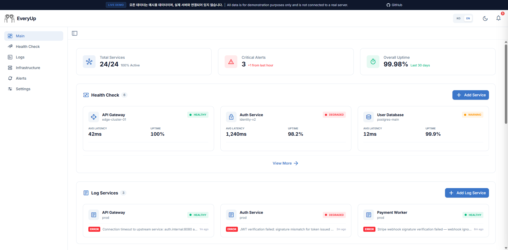
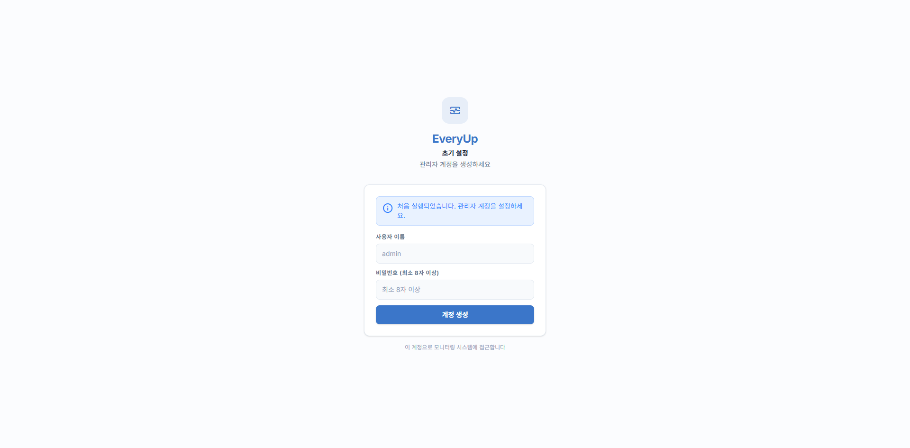

<p align="center">
  
</p>

# EveryUp — 셀프 호스팅 모니터링 대시보드


업타임 모니터링, 서버 메트릭, 로그 수집, 알림을 하나의 셀프 호스팅 대시보드에서.
Prometheus, Grafana, 클라우드 없이 — 단일 바이너리와 SQLite 파일만으로 실행됩니다.

[English](README.md) | **한국어**

[](https://ai-turn.github.io/everyup/)


**[라이브 데모 보기 →](https://ai-turn.github.io/everyup/)**

---

## 목차

- [EveryUp을 선택하는 이유](#everyup을-선택하는-이유)
- [주요 기능](#주요-기능)
- [메뉴 안내](#메뉴-안내)
  - [헬스체크](#헬스체크)
  - [로그](#로그)
  - [인프라](#인프라)
  - [알림](#알림)
  - [환경설정](#환경설정)
- [스크린샷](#스크린샷)
- [빠른 시작](#빠른-시작)
  - [Docker](#docker)
  - [Docker Compose](#docker-compose)
  - [로컬 개발](#로컬-개발)
- [설정](#설정)
- [데이터 백업](#데이터-백업)
- [로그 에이전트](#로그-에이전트)
- [문서](#문서)
- [기여](#기여)
- [라이선스](#라이선스)

---

## EveryUp을 선택하는 이유

대부분의 서버 모니터링 도구는 하나의 문제만 해결합니다. EveryUp은 업타임 체크, 인프라 메트릭, 로그 수집, 알림을 **단일 셀프 호스팅 바이너리**로 통합합니다 — Uptime Kuma + Grafana + 로그 수집기를 대체하는 경량 오픈소스 솔루션입니다.

- **외부 의존성 제로** — Go 바이너리 + SQLite, Docker가 실행되는 어디서나 동작
- **프라이버시 우선** — 모니터링 데이터가 내 인프라 밖으로 나가지 않음
- **하나의 대시보드** — 헬스체크, 서버 메트릭, 로그, 알림을 한 곳에서
- **무료 오픈소스** — MIT 라이선스, 몇 분 만에 셀프 호스팅 가능

---

## 주요 기능

| 기능 | 설명 |
|------|------|
| **업타임 모니터링** | HTTP/TCP 헬스체크, 업타임, 레이턴시 추적 |
| **인프라** | CPU/메모리/디스크/네트워크 실시간 수집 (로컬 + SSH 원격) |
| **API 요청 인스펙터** | 샘플링·서버사이드 마스킹·본문 검사가 가능한 요청/응답 단위 캡처 |
| **알림** | Telegram / Discord / Slack 채널 연동, 임계값 기반 규칙 |
| **로그 관리** | 통합 로그 뷰어, 검색, 로그 에이전트 수집 및 HTTP 요청/응답 인스펙터 |
| **실시간 스트리밍** | WebSocket 기반 메트릭 실시간 업데이트 |

---

## 메뉴 안내

### 헬스체크

HTTP 및 TCP 엔드포인트의 가용성을 주기적으로 점검합니다.

- **모니터링 방식**: 일정 주기(interval) 또는 cron 표현식으로 체크 스케줄 설정
- **상세 화면**: 실시간 메트릭, 응답 시간 차트, 최근 체크 이력 바, 장애 이력 확인
- **장애 감지**: 연속 실패 횟수 초과 시 알림 채널로 즉시 발송

### 로그

외부 서비스의 로그를 수집하고 대시보드에서 조회합니다.

- **로그 뷰어**: 레벨(error / warn / info / debug / trace) 필터링, 키워드 검색, 타임라인 확인
- **API 요청 인스펙터**: 서비스별 HTTP 요청·응답 캡처 — 샘플링 비율, 에러 전용 모드, 헤더·바디 마스킹 설정 포함
- **통합 탭**: 로그 에이전트 연동용 API 키 발급 및 코드 스니펫 제공
- **수집 설정**: 허용 로그 레벨 필터, API 캡처 모드를 서비스별로 독립 관리

### 인프라

서버의 리소스 사용량을 실시간으로 수집하고 추이를 기록합니다.

- **로컬 수집**: 에이전트가 설치된 서버의 CPU · 메모리 · 디스크 · 네트워크를 직접 수집
- **SSH 원격 수집**: 별도 에이전트 없이 SSH 접속만으로 원격 서버 메트릭 수집
- **상세 화면**: 방사형 게이지(실시간) + 트렌드 차트(시간대별 추이) + 프로세스 목록

### 알림

임계값 초과 또는 장애 발생 시 외부 채널로 즉시 알림을 발송합니다.

- **채널**: Telegram · Discord · Slack · Webhook 지원, 다중 채널 동시 등록 가능
- **규칙**: 헬스체크 다운, 인프라 CPU/메모리/디스크 임계값, 로그 에러/경고 발생 조건 설정
- **이력**: 발송 성공·실패 내역을 채널 및 타임라인별로 조회

### 환경설정

EveryUp 전체에 적용되는 시스템 설정을 관리합니다.

- **계정**: 관리자 비밀번호 변경
- **데이터 보존**: 로그, 메트릭, 알림 이력의 보존 기간 설정
- **수집 주기**: 인프라 메트릭 수집 및 저장 간격 설정
- **테마**: 라이트 / 다크 모드 전환

---

## 스크린샷






---

## 빠른 시작

별도 설정이 필요 없습니다. 처음 실행 후 브라우저에서 관리자 계정을 직접 생성합니다. 암호화 키와 JWT 시크릿은 최초 실행 시 자동 생성됩니다.

`linux/amd64`와 `linux/arm64` 모두 지원합니다 — Docker가 플랫폼에 맞는 이미지를 자동으로 선택합니다.

### Docker

```bash
docker pull aiturn/everyup:latest
```

```bash
docker run -d \
  --name everyup \
  -p 3001:3001 \
  -v everyup-data:/app/data \
  aiturn/everyup:latest
```

### Docker Compose

**1.** `.env` 파일 생성 — 모든 항목은 선택 사항입니다. 기본값으로 충분하다면 이 파일 없이 진행해도 됩니다.

```bash
# Linux / macOS
cp .env.example .env

# Windows (PowerShell)
Copy-Item .env.example .env
```

또는 변경이 필요한 항목만 직접 작성합니다:

```dotenv
# EVERYUP_SERVER_PORT=3001
# EVERYUP_ADMIN_USERNAME=admin
# EVERYUP_ADMIN_PASSWORD=changeme
# TZ=Asia/Seoul
```

> `EVERYUP_ADMIN_USERNAME`와 `EVERYUP_ADMIN_PASSWORD`를 함께 설정하면 EveryUp은 시작할 때마다 해당 관리자 계정을 생성하거나 비밀번호를 다시 설정합니다. 초기 계정을 미리 만들거나 비밀번호를 재설정하려는 경우가 아니라면, 최초 설정 이후에는 비워 두는 것을 권장합니다.

**2.** `docker-compose.yml` 생성:

```yaml
services:
  everyup:
    image: aiturn/everyup:latest
    container_name: everyup
    ports:
      - "${EVERYUP_SERVER_PORT:-3001}:3001"
    volumes:
      - everyup-data:/app/data
    env_file:
      - path: .env
        required: false
    restart: unless-stopped

volumes:
  everyup-data:
```

**3.** 시작:

```bash
docker compose up -d
```

**http://localhost:3001** 접속 후 관리자 계정을 생성합니다.

---

### 로컬 개발

**사전 준비:** [Go 1.24+](https://go.dev/dl/), [Node.js 22+](https://nodejs.org/), [pnpm](https://pnpm.io/installation)

```bash
git clone https://github.com/ai-turn/everyup.git
cd everyup
```

**백엔드**
```bash
cd backend
go run ./cmd/server
# → http://localhost:3001
```

> 로컬 개발 시 CORS 설정이 필요하면 `.env.example`을 `.env`로 복사하세요.
> - Linux / macOS: `cp .env.example .env`
> - Windows (PowerShell): `Copy-Item .env.example .env`
> - Windows (CMD): `copy .env.example .env`

**프론트엔드**
```bash
cd frontend
pnpm install
pnpm dev
# → http://localhost:5173
```

**백엔드 테스트 실행**
```bash
cd backend
go test ./internal/api/handlers/ -v
```

**프로젝트 구조**
```
everyup/
├── frontend/      # React + Vite + TypeScript + Tailwind CSS
├── backend/       # Go (Fiber) + SQLite + WebSocket
└── log-agent/     # Fluent Bit 기반 로그 수집 에이전트
```

---

## 설정

`EVERYUP_` 접두사 환경 변수로 `config.json`의 모든 값을 오버라이드할 수 있습니다.

| 환경 변수 | 기본값 | 설명 |
|-----------|--------|------|
| `EVERYUP_SERVER_MODE` | `production` | 실행 모드: `development` 또는 `production` |
| `EVERYUP_SERVER_PORT` | `3001` | 서버 포트 |
| `EVERYUP_SERVER_ALLOWORIGINS` | *(동일 오리진)* | 허용할 CORS 오리진 (예: `https://your-domain.com`) |
| `EVERYUP_ADMIN_USERNAME` | *(미설정)* | 시작 시 관리자 계정 생성 또는 비밀번호 초기화 |
| `EVERYUP_ADMIN_PASSWORD` | *(미설정)* | 위 계정의 비밀번호 |
| `EVERYUP_DATABASE_PATH` | `./data/monitoring.db` | SQLite 파일 경로 |
| `TZ` | 시스템 기본값 | 타임존 (예: `Asia/Seoul`) |

전체 설정 옵션은 [backend/README.md](backend/README.md)를 참고하세요.

---

## 데이터 백업

EveryUp의 모든 데이터는 SQLite 단일 파일에 저장됩니다.

```bash
# 볼륨 위치 확인
docker volume inspect everyup-data

# 로컬 머신으로 백업 (컨테이너 실행 중에도 가능)
docker cp everyup:/app/data/monitoring.db ./monitoring.db.bak
```

---

## 로그 에이전트

외부 서비스의 로그를 수집하여 EveryUp 대시보드로 전달하려면 해당 서버에 `everyup-log-agent`를 배포합니다.

**1. API 키 발급**

EveryUp 대시보드 → **로그 → 서비스 상세 → Integration** 탭에서 API 키를 발급받습니다.

**2. 에이전트 실행**

```bash
docker pull aiturn/everyup-log-agent:latest
```

```bash
docker run -d \
  --name everyup-log-agent \
  -v /var/log/myapp:/var/log/app:ro \
  -e LOG_AGENT_ENDPOINT=http://your-everyup-server:3001 \
  -e LOG_AGENT_API_KEY=everyup_your_api_key \
  --restart unless-stopped \
  aiturn/everyup-log-agent:latest
```

`linux/amd64`와 `linux/arm64` 모두 지원합니다 — Docker가 플랫폼에 맞는 이미지를 자동으로 선택합니다.

자세한 내용은 [log-agent/README.md](log-agent/README.md)를 참고하세요.

---

## 문서

| 문서 | 설명 |
|------|------|
| [backend/README.md](backend/README.md) | 백엔드 API 및 설정 문서 |
| [frontend/README.md](frontend/README.md) | 프론트엔드 개발 환경 및 페이지 구조 |
| [log-agent/README.md](log-agent/README.md) | 로그 에이전트 배포 가이드 |
| [docs/NOTIFICATION_SETUP.ko.md](docs/NOTIFICATION_SETUP.ko.md) | 텔레그램, 디스코드 & 슬랙 채널 설정 가이드 |

---

## 기여

버그 리포트나 기능 제안은 [GitHub Issues](https://github.com/ai-turn/everyup/issues)에 남겨주세요.

Pull Request를 보내실 때:
- 변경 사항과 이유를 간략히 설명해 주세요
- `go test ./internal/api/handlers/ -v` 실행 후 테스트 통과를 확인해 주세요
- 하나의 PR에는 하나의 관심사만 담아 주세요

---

## 라이선스

MIT
