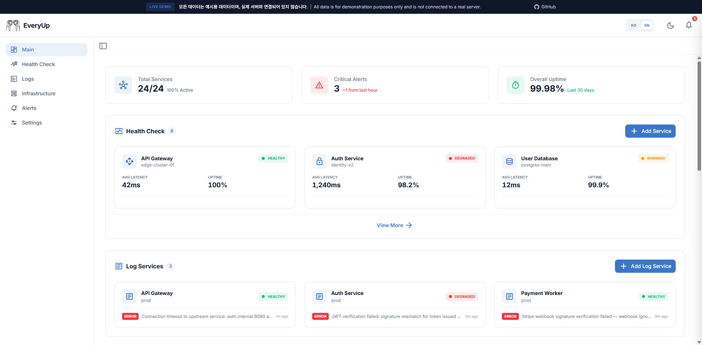

# EveryUp — Self-Hosted Monitoring Dashboard


Open-source uptime monitoring, server metrics, log collection, and alerting in one self-hosted dashboard.
No Prometheus, no Grafana, no cloud required — just a single binary and a SQLite file.

[한국어](README.ko.md) | **English**

[](https://ai-turn.github.io/everyup/)


**[Live Demo →](https://ai-turn.github.io/everyup/)**

---

## Why EveryUp?

Most server monitoring tools solve one problem. EveryUp combines uptime checks, infrastructure metrics, log collection, and alerting into a **single self-hosted binary** — making it a lightweight open-source alternative to Uptime Kuma + Grafana + a log aggregator.

- **Zero external dependencies** — Go binary + SQLite, runs anywhere Docker runs
- **Privacy-first** — your monitoring data never leaves your own infrastructure
- **One dashboard** — health checks, server metrics, logs, and alerts in one place
- **Free and open source** — MIT licensed, self-hostable in minutes

---

## Features

| Feature | Description |
|---------|-------------|
| **Uptime Monitoring** | HTTP/TCP health checks, uptime tracking, latency trends |
| **Infrastructure** | Real-time CPU/memory/disk/network collection (local + SSH remote) |
| **API Request Inspector** | Per-request capture with configurable sampling, server-side masking, and body inspection |
| **Alerts** | Telegram / Discord / Slack integration, threshold-based rules |
| **Log Management** | Unified log viewer, search, log agent collection, and per-request HTTP inspector |
| **Real-time Streaming** | WebSocket-based live metric updates |

---

## Screenshots




---

## Quick Start

No pre-configuration needed. On first launch, create your admin account directly in the browser. Encryption keys and JWT secrets are auto-generated on first run.

Supports `linux/amd64` and `linux/arm64` — Docker automatically pulls the correct variant.

### Docker

```bash
docker pull aiturn/everyup:latest
```

```bash
docker run -d \
  --name everyup \
  -p 3001:3001 \
  -v everyup-data:/app/data \
  aiturn/everyup:latest
```

### Docker Compose

**1.** Create `.env` — all variables are optional. Skip this file entirely if the defaults are fine.

```bash
# Linux / macOS
cp .env.example .env

# Windows (PowerShell)
Copy-Item .env.example .env
```

Or create it manually with the variables you want to override:

```dotenv
# MT_SERVER_PORT=3001
# MT_ADMIN_USERNAME=admin
# MT_ADMIN_PASSWORD=changeme
# TZ=Asia/Seoul
```

> If `MT_ADMIN_USERNAME` and `MT_ADMIN_PASSWORD` are both set, EveryUp creates or resets that admin account on every startup. Leave them unset after the initial setup unless you intentionally want to pre-seed or reset the admin login.

**2.** Create `docker-compose.yml`:

```yaml
services:
  everyup:
    image: aiturn/everyup:latest
    container_name: everyup
    ports:
      - "${MT_SERVER_PORT:-3001}:3001"
    volumes:
      - everyup-data:/app/data
    env_file:
      - path: .env
        required: false
    restart: unless-stopped

volumes:
  everyup-data:
```

**3.** Start:

```bash
docker compose up -d
```

Open **http://localhost:3001** and create your admin account.

---

### Local Development

**Prerequisites:** [Go 1.24+](https://go.dev/dl/), [Node.js 22+](https://nodejs.org/), [pnpm](https://pnpm.io/installation)

```bash
git clone https://github.com/ai-turn/everyup.git
cd everyup
```

**Backend**
```bash
cd backend
go run ./cmd/server
# → http://localhost:3001
```

> Copy `.env.example` to `.env` before running if you need custom CORS settings for local dev (port 5173).
> - Linux / macOS: `cp .env.example .env`
> - Windows (PowerShell): `Copy-Item .env.example .env`
> - Windows (CMD): `copy .env.example .env`

**Frontend**
```bash
cd frontend
pnpm install
pnpm dev
# → http://localhost:5173
```

**Run backend tests**
```bash
cd backend
go test ./internal/api/handlers/ -v
```

**Project Structure**
```
everyup/
├── frontend/      # React + Vite + TypeScript + Tailwind CSS
├── backend/       # Go (Fiber) + SQLite + WebSocket
└── log-agent/     # Fluent Bit-based log collection agent
```

---

## Configuration

All `config.json` values can be overridden with `MT_`-prefixed environment variables.

| Environment Variable | Default | Description |
|----------------------|---------|-------------|
| `MT_SERVER_MODE` | `production` | Run mode: `development` or `production` |
| `MT_SERVER_PORT` | `3001` | Server port |
| `MT_SERVER_ALLOWORIGINS` | *(same-origin)* | Allowed CORS origins (e.g. `https://your-domain.com`) |
| `MT_ADMIN_USERNAME` | *(unset)* | Creates or resets an admin account on startup |
| `MT_ADMIN_PASSWORD` | *(unset)* | Password for the admin account above |
| `MT_DATABASE_PATH` | `./data/monitoring.db` | SQLite file path |
| `TZ` | System default | Timezone (e.g. `America/New_York`) |

See [backend/README.md](backend/README.md) for the full configuration reference.

---

## Data Backup

All EveryUp data is stored in a single SQLite file.

```bash
# Inspect volume location
docker volume inspect everyup-data

# Backup to your local machine (safe while the container is running)
docker cp everyup:/app/data/monitoring.db ./monitoring.db.bak
```

---

## Log Agent

Deploy `everyup-log-agent` on any server to collect logs from external services and forward them to your EveryUp dashboard.

**1. Get an API key**

In the EveryUp dashboard, go to **Health Check → Service detail → Integration** tab to generate an API key.

**2. Run the agent**

```bash
docker pull aiturn/everyup-log-agent:latest
```

```bash
docker run -d \
  --name everyup-log-agent \
  -v /var/log/myapp:/var/log/app:ro \
  -e LOG_AGENT_ENDPOINT=http://your-everyup-server:3001 \
  -e LOG_AGENT_API_KEY=la_your_api_key \
  --restart unless-stopped \
  aiturn/everyup-log-agent:latest
```

Supports `linux/amd64` and `linux/arm64` — Docker selects the correct variant automatically.

See [log-agent/README.md](log-agent/README.md) for more details.

---

## Documentation

| Document | Description |
|----------|-------------|
| [backend/README.md](backend/README.md) | Backend API and configuration reference |
| [frontend/README.md](frontend/README.md) | Frontend dev setup and page structure |
| [log-agent/README.md](log-agent/README.md) | Log agent deployment guide |
| [docs/NOTIFICATION_SETUP.md](docs/NOTIFICATION_SETUP.md) | Telegram, Discord & Slack channel setup guide |

---

## Contributing

Bug reports and feature requests are welcome via [GitHub Issues](https://github.com/ai-turn/everyup/issues).

When submitting a Pull Request:
- Include a brief description of what changed and why
- Run `go test ./internal/api/handlers/ -v` and confirm tests pass
- Keep changes focused — one concern per PR

---

## License

MIT
