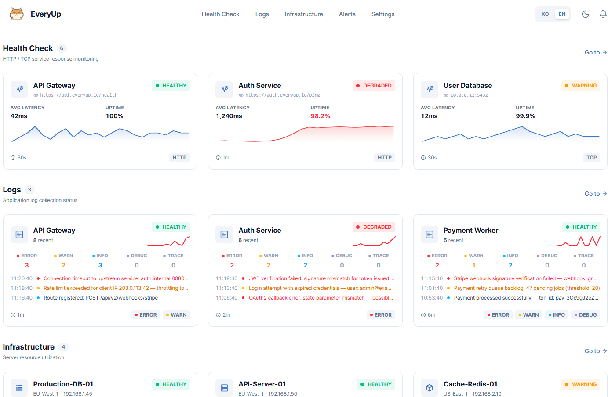

<p align="center">
  
</p>

<h1 align="center">EveryUp</h1>

<p align="center">
  Self-hosted monitoring dashboard + AI Agent that watches your Docker services automatically.
</p>

<p align="center">
  <a href="README.ko.md">한국어</a> ·
  <a href="https://ai-turn.github.io/everyup/">Live Demo</a> ·
  <a href="#quick-start">Quick Start</a> ·
  <a href="#repository-layout">Repository Layout</a>
</p>

<p align="center">
  <a href="https://ai-turn.github.io/everyup/"></a>
  
  
  
  
</p>

<p align="center">
  
</p>

## What is EveryUp?

A self-hosted tool for monitoring the services you run on your servers.

- **Instant Telegram alerts** when a service goes down
- **Browser dashboard** for status, logs, and alert history
- **Auto-discovery** via Docker labels — no manual registration needed
- **AI explanations** when connected to an LLM — tells you what broke and why

No Prometheus, no Grafana, no heavy stack. One Docker Compose command and you're running.

## Two-part setup

EveryUp has two parts. **You only need one to get started.**

| | EveryUp Web | EveryUp Agent |
|---|---|---|
| What it does | Browser dashboard, alert config, history storage | Watches services in real time, sends Telegram alerts |
| Requires | Docker | Docker + a Telegram bot |
| Service registration | Add manually in the Web UI | Docker labels only — auto-discovered |
| Together? | Agent-discovered services show up in the Web dashboard | |

Start with **Web only**, then add the Agent when you need Telegram alerts.

## Prerequisites

- Docker 24+ and Docker Compose v2+
- (Agent only) A Telegram bot token and chat ID → [How to create a Telegram bot](docs/NOTIFICATION_SETUP.md)

## Quick Start

### Step 1: Run the Web dashboard

```bash
git clone https://github.com/ai-turn/everyup.git
cd everyup
docker compose up -d
```

Open `http://localhost:3001` → create an admin account → done.

> To change the port or pre-seed an admin account, copy `.env.example` to `.env` and edit it before running Compose.

### Step 2: Add the Agent (optional)

Skip this step if you do not have a Telegram bot token yet.

Add these two lines to your `.env` file:

```bash
EVERYUP_TELEGRAM_BOT_TOKEN=123456:ABC-DEF...   # from BotFather
EVERYUP_TELEGRAM_CHAT_IDS=123456789            # chat ID to receive alerts
```

Then start the Agent:

```bash
docker compose --profile agent up -d
```

The Agent sends a "started" message to Telegram within seconds.

### Step 3: Monitor your services

Add labels to the containers you want watched (in your own `docker-compose.yml`):

```yaml
services:
  api:
    image: my-api:latest
    labels:
      everyup.enabled: "true"
      everyup.service.name: "api"
      everyup.health.url: "http://api:8080/health"

  postgres:
    image: postgres:16
    labels:
      everyup.enabled: "true"
      everyup.service.name: "postgres"
      everyup.health.type: "tcp"
      everyup.health.port: "5432"
```

The Agent discovers labeled containers automatically within the next 30-second check. No Web UI registration needed.

## Repository Layout

```text
everyup/
  web/
    backend/       # Go API server, SQLite, OTLP ingestion, alert engine
    frontend/      # React/Vite dashboard
    Dockerfile     # Full-stack Web image

  agent/           # Standalone EveryUp Agent
    cmd/           # Entry point
    internal/      # Core packages
    docs/          # Per-feature Agent docs
    compose.example.yml

  docs/            # Operator docs, changelog, roadmaps
  docker-compose.yml
  .env.example
```

## Local Development

For contributors or anyone who wants to modify the source.

**Prerequisites:** [Go 1.24+](https://go.dev/dl/), [Node.js 22+](https://nodejs.org/), [pnpm](https://pnpm.io/installation)

Run the Web backend:

```bash
cd web/backend
go run ./cmd/server
```

Run the Web frontend (separate terminal):

```bash
cd web/frontend
pnpm install
pnpm dev
```

Open `http://localhost:5173`.

Run Agent tests:

```bash
cd agent
go test ./...
```

## Documentation

| Document | Contents |
| --- | --- |
| [agent/README.md](agent/README.md) | Agent setup, Docker labels, ChatOps, Web sync |
| [docs/NOTIFICATION_SETUP.md](docs/NOTIFICATION_SETUP.md) | **How to create a Telegram bot**, Discord, Slack |
| [docs/BACKUP_RESTORE.md](docs/BACKUP_RESTORE.md) | Data backup and restore |
| [docs/API_REQUEST_LOGGING_GUIDE.md](docs/API_REQUEST_LOGGING_GUIDE.md) | API request logging guide |
| [web/README.md](web/README.md) | Web backend and frontend details |

## License

MIT
